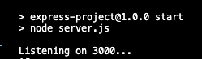

## About
 I created this application to practice NodeJS and ExpressJS. The app is organized using the MVC model,
 it renders templates using a template engine called hbs(Handlebars.js).
 
 The main concepts practiced in this app where:
 
 1. How to create an Express.js server
 2. Middleware 
 3. Routing in Express.js
 4. The MVC design pattern
 5. Server side rendering
 6. Separation of concerns
 7. RESTful API convention
 
 ## Run locally 
 
 In order to run this app locally, make sure you clone this repository in your local machine. Instructions to [clone a repo](https://docs.github.com/en/repositories/creating-and-managing-repositories/cloning-a-repository). Once you cloned the repository, navigate to the project folder and download the dependencies (all the packages listed in the package.json file necessary for the app to run) by running: `npm install`. At this point the app should be ready to run, which you can do with the following command `npm start`.

 You'll know the server is running when you see this in your terminal: 

 

 ## Testing endpoints

 Once you have the server up and running, you can visit [localhost](http://localhost:3000/). You can make two types of request, GET and POST.
 
  ### GET
  
  [get-friends](http://localhost:3000/friends)
  
  [get-friend](http://localhost:3000/friends/1) pass a number from 0 to 3 to get a different friend
  
  [get-messages](http://localhost:3000/messages)
  
  ### POST
  
  To make POST requests I use a tool called Postman
  
  
  
 
 
 
 
